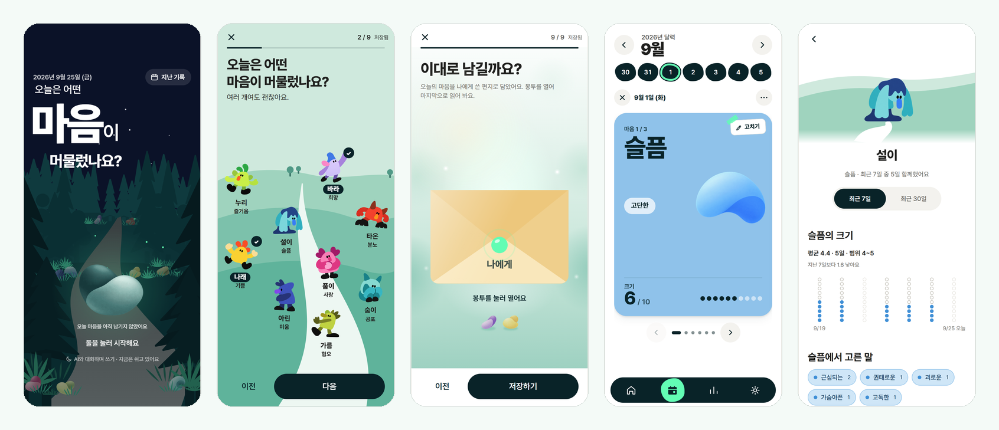
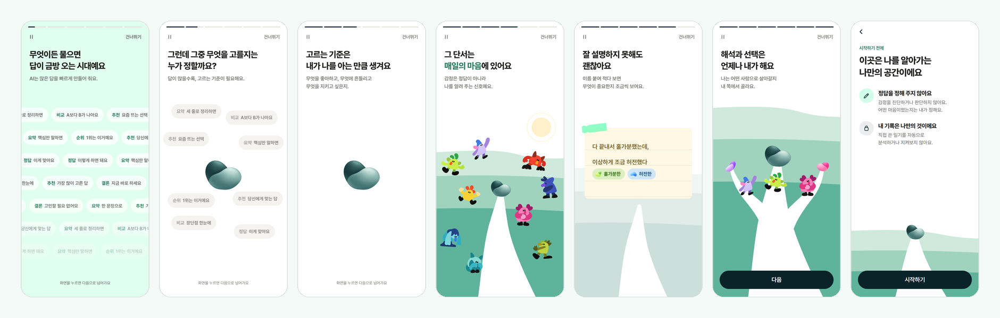
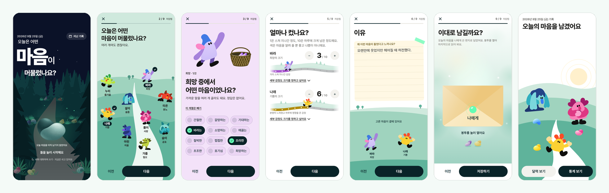
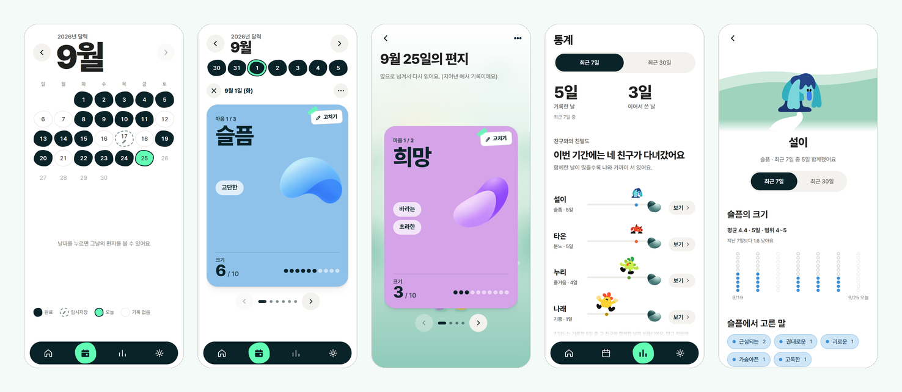
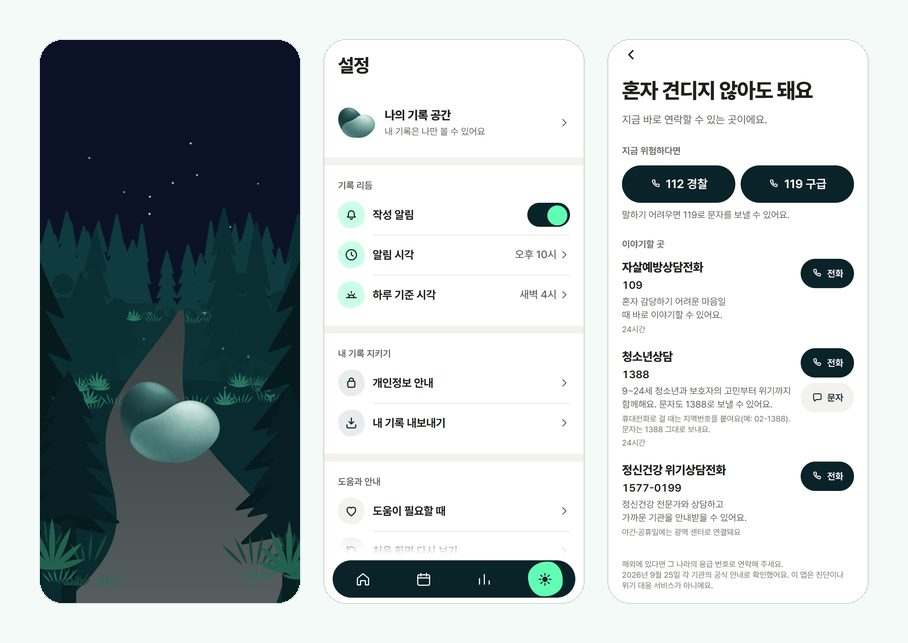
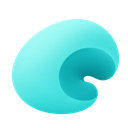
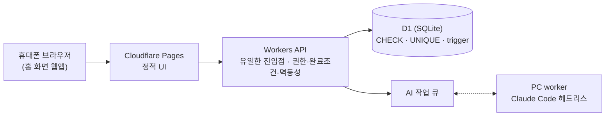

<div align="center">


# 감정일기

**AI가 수많은 답을 만들어 주는 시대,<br>감정을 기록하며 나를 이해하고 내 삶의 기준을 만들어 가는 자기이해 서비스**

[](https://github.com/SKUnohtaekyung/emotion-diary/actions/workflows/harness.yml)


</div>



---

## 왜 만드나요

> AI가 답을 만드는 능력이 커질수록, 사람에게는 **무엇을 중요하게 여기고 무엇을 고를지에 대한 자기 기준**이 더 필요해집니다.<br>
> 감정은 그 기준을 알아 가는 가장 가까운 신호입니다. 이 서비스는 그 신호를 **내 말로** 적고, 돌아보고, 스스로 고르도록 돕습니다.

| 감정은 정답이 아니라 신호 | AI는 나를 정의하지 않는다 | 기록은 의무가 아니다 |
| :---: | :---: | :---: |
| 진단하거나 판정하지 않습니다.<br>어떤 마음이었는지는 내가 정합니다. | AI는 정리하고 질문할 뿐,<br>해석과 선택은 늘 사용자에게 남깁니다. | 쓰지 못한 날은 실패가 아닙니다.<br>필요할 때 돌아올 수 있으면 됩니다. |

전체 이야기와 근거(ILO·WEF·감정 세분화·표현적 글쓰기 연구, 과대해석 금지 기준)는 [서비스 WHY](docs/SERVICE_WHY.md)에 있습니다.

---

## 처음 만나는 이야기



영상이 아니라 앱 안에서 그림이 움직이는 **여섯 장면 이야기**입니다. 답 조각이 쏟아지는 시대 → 고르는 사람(나의 돌) → 기준은 나를 아는 만큼 → 단서는 매일의 마음(아홉 친구) → 섞인 하루에 이름 붙이기 → 해석과 선택은 내가. 자동으로 넘어가고, 누르면 다음, 건너뛰기·**일시정지**가 늘 있으며, 움직임 줄이기에서는 장면마다 '다음'을 기다립니다.

---

## 하루를 적는 흐름



| ① 오늘 | ② 마음 고르기 | ③ 세부 감정 | ④ 크기 | ⑤ 이유 | ⑥ 편지 | ⑦ 완료 |
| :---: | :---: | :---: | :---: | :---: | :---: | :---: |
| 어두운 숲 가운데<br>돌을 눌러 시작 | 아홉 친구 중<br>여러 마음을 고름 | 194개 세부 감정 중<br>가까운 말 | 1~10,<br>길 위의 친구 | 종이 노트에<br>내 말로 | 나에게 쓰는 편지로<br>다시 읽고 남김 | 고른 친구들이<br>언덕에 모임 |

일기의 원형(날짜 · 있었던 일 · 감정과 크기 · 이유 · 칭찬 셋 · 감사 셋)은 저장·조회·내보내기 어디서도 순서와 뜻을 잃지 않습니다. 하루에 기록은 하나이고, 새 기록은 그날만 씁니다.

---

## 돌아보기



- **달력** — 완료한 날은 조약돌로 채워지고, 날짜를 누르면 그 주로 접히며 그날의 편지가 크게 열립니다.
- **통계** — 요약 두 칸과 **친구와의 친밀도**(기록한 날 중 그 친구와 함께한 날의 비율을 길 위의 거리로). 친구를 누르면 그 감정의 **날마다 크기(점 열 개 기둥)**, 고른 말, 함께한 날이 나옵니다.
- 기록이 없는 날은 0이 아니라 '없음'이고, 서로 다른 감정을 한데 평균 내지 않습니다. 모든 수치는 완료한 기록만으로 다시 계산할 수 있습니다.

---

## 스스로 지키는 공간



- **앱 시작** — 오늘 화면의 숲과 돌 하나가 숨 쉬다 그대로 오늘 화면이 됩니다(0.3초 안에 준비되면 보이지 않음).
- **설정** — 알림·하루 기준 시각·개인정보 안내·내보내기(JSON)·영구 삭제를 하려는 일 기준으로 묶었습니다.
- **도움이 필요할 때** — 정부·공공기관 공식 안내로 확인한 연락처(112·119·109·1388·1577-0199)에 바로 전화·문자를 걸 수 있습니다. 이 앱은 진단이나 위기 대응 서비스가 아닙니다.

---

## 아홉 친구

감정을 찾기 쉽게 돕는 모양일 뿐, 좋고 나쁨이나 크기의 우열을 뜻하지 않습니다. 모두 같은 크기로 섭니다.

|  |  |  |  |  |  |  |  |  |
| :---: | :---: | :---: | :---: | :---: | :---: | :---: | :---: | :---: |
|  |  |  |  |  |  |  |  |  |
| **누리**<br>즐거움 | **나래**<br>기쁨 | **바라**<br>희망 | **품이**<br>사랑 | **설이**<br>슬픔 | **타온**<br>분노 | **아린**<br>미움 | **숨이**<br>공포 | **가름**<br>혐오 |

감정 어휘는 9계열 · 세부 감정 194개(taxonomy v2)이고, 색·글자·간격은 [디자인 토큰](design/tokens.json) 한 곳에서 나옵니다. 부품 견본은 [스타일 가이드](design/style-guide.html)에 있습니다.

---

## 지키는 선

| 하지 않는 것 | 대신 |
| --- | --- |
| 감정·성격·정신건강을 진단하거나 판정 | 사용자가 고른 말을 그대로 보존하고, AI 출력은 후보·질문·가설로만 |
| 직접 쓴 일기를 자동으로 분석·감시 | 위기 감지는 AI 대화 경로에서만(D-020), 한계를 알림 |
| '우울 완화·치유' 같은 효능 표시 | 기록은 돌아볼 재료를 남긴다는 만큼만 말함 |
| 유료 AI API | PC의 worker가 작업 큐를 가져가 Claude Code 헤드리스로 처리 |
| 근거 없는 심리학적 해석 | 검수된 근거 카드와 독립 검증기를 통과할 때만, 아니면 통계만 |

---

## 어떻게 만들어지나요



AI가 없어도 직접 작성과 돌아보기는 그대로 동작합니다. 일기 원문은 서버 권한 검사 뒤에만 읽고 쓰며 근거 저장소나 로그에 섞이지 않습니다. 삭제는 확인 뒤 영구 삭제, 내보내기는 schema version이 있는 UTF-8 JSON입니다.

---

## 지금 어디쯤

| 단계 | 상태 |
| --- | --- |
| Phase 0 부트스트랩 — 정본 명세·검증 하네스·기술 스파이크 | 마무리 중 |
| **브라우저 화면 시안(`web/`)** — 사용자 QA로 무드·흐름 재구성(결정 D-050~D-096) | **진행 중** · 저장·인증·AI 없음 |
| Phase 1 기반·데이터 무결성 → Phase 2 직접 작성 → Phase 4 돌아보기·알림 | 대기 |
| 제한 MVP 릴리스 | 대기 — 위기 연락처 임상·안전 검토, 건강 민감정보 별도 동의가 출시 조건 |
| Phase 3·5 AI 대화 작성·근거 있는 돌아보기 | 후행 |

진행 상황과 다음 할 일은 [docs/STATUS.md](docs/STATUS.md), 결정은 [docs/DECISIONS.md](docs/DECISIONS.md), 과정은 [docs/PROCESS_LOG.md](docs/PROCESS_LOG.md)에 있습니다.

---

## 직접 눌러 보기

Node.js 22가 있으면 저장소 루트에서:

```sh
node scripts/web-preview.mjs 4174
```

`http://localhost:4174`에서 화면 시안을 눌러 볼 수 있습니다(입력은 저장·전송되지 않습니다). 몇 가지 입구:

| 주소 | 보이는 것 |
| --- | --- |
| `/#/welcome` | 여섯 장면 이야기 |
| `/?splash=3000#/today` | 앱 시작 로딩 화면을 3초 붙잡아 보기 |
| `/#/today` | 오늘 화면(어두운 숲) |
| `/#/calendar` · `/#/stats` · `/#/settings` | 달력 · 통계 · 설정 |

디자인 견본은 `node scripts/preview.mjs 4173` 뒤 `http://localhost:4173/style-guide.html`에서 봅니다.

---

## 검증

```sh
npm ci
npm run verify:quick
npm run verify:full
```

`quick`은 문서·링크·JSON·비밀값·원자료 해시와 함께 색 대비, 캐릭터 자산, taxonomy, 하네스·계약 어긋남, 로딩 화면 그림, 위기 연락처(공식 출처·허용 번호) 검사를 돌립니다. `full`은 여기에 `package.json`의 `lint`·`typecheck`·`test`·`build`를 더합니다. 같은 검사가 GitHub Actions에서 Ubuntu·Windows 양쪽으로 돕니다.

<details>
<summary>설치 메모</summary>

캐릭터 자산 검사가 `sharp`를 쓰므로 `npm ci`가 먼저입니다. 구버전 npm(10.9 계열)은 설치하면서 `package-lock.json`의 `libc` 줄을 지웁니다. 설치에는 문제가 없으니 그 변경은 커밋하지 말고 `git checkout -- package-lock.json`으로 되돌립니다. `outputs/`와 `work/`는 스파이크·검증 중간물이며 저장소에 포함되지 않습니다.

</details>

---

## 저장소 지도

<details>
<summary>판단별 정본 문서</summary>

| 판단 | 정본 |
| --- | --- |
| 서비스를 만드는 이유(모든 판단의 기준) | [docs/SERVICE_WHY.md](docs/SERVICE_WHY.md) |
| 제품 범위·완료 조건 | [PRD.md](PRD.md) |
| 시스템 경계·배포·신뢰 경계 | [docs/ARCHITECTURE.md](docs/ARCHITECTURE.md) |
| 저장 구조·무결성·삭제·내보내기 | [docs/DATA_MODEL.md](docs/DATA_MODEL.md) |
| 화면·직접 작성·AI 작성 흐름 | [docs/UX_SPEC.md](docs/UX_SPEC.md) |
| 색·글자·구성요소·접근성 | [docs/DESIGN_SYSTEM.md](docs/DESIGN_SYSTEM.md), [design/tokens.json](design/tokens.json), [design/style-guide.html](design/style-guide.html) |
| 서비스 스토리·세계관·말투·브랜드 원칙 | [docs/BRAND_STORY.md](docs/BRAND_STORY.md) |
| 디자인·브랜드 선택의 근거(왜 골랐나, 검토한 대안, 측정) | [docs/DESIGN_RATIONALE.md](docs/DESIGN_RATIONALE.md) |
| AI·RAG·근거·검증기 | [docs/AI_RAG_SPEC.md](docs/AI_RAG_SPEC.md) |
| 금지 출력·위기·개인정보 정책 | [docs/SAFETY_POLICY.md](docs/SAFETY_POLICY.md) |
| 위기 안내 연락처(공식 출처, versioned) | [data/crisis-resources/kr.json](data/crisis-resources/kr.json) |
| 테스트·평가·출시 게이트 | [docs/EVAL_PLAN.md](docs/EVAL_PLAN.md) |
| 확정 기술 결정 | [docs/DECISIONS.md](docs/DECISIONS.md) |
| 알려진 위험 | [docs/RISK_REGISTER.md](docs/RISK_REGISTER.md) |
| 단계별 구현 순서 | [docs/ROADMAP.md](docs/ROADMAP.md) |
| 요구사항 추적 | [docs/TRACEABILITY.md](docs/TRACEABILITY.md) |
| 진행 상황·다음 할 일 | [docs/STATUS.md](docs/STATUS.md) |
| 개발 과정 기록(단계·시행착오·검증) | [docs/PROCESS_LOG.md](docs/PROCESS_LOG.md) |
| 기계 검증용 데이터/AI 계약 | [schemas/README.md](schemas/README.md) |
| 사용자 제공 원자료 | [references/README.md](references/README.md) |

에이전트와 사람이 함께 작업하는 규칙은 [AGENTS.md](AGENTS.md), 작업 루프와 하네스는 [docs/AGENT_WORKFLOW.md](docs/AGENT_WORKFLOW.md), 첫 감사 절차는 [BOOTSTRAP.md](BOOTSTRAP.md), 지금 승인된 작업과 증거는 [tasks/CURRENT_TASK.md](tasks/CURRENT_TASK.md)에 있습니다.

</details>
